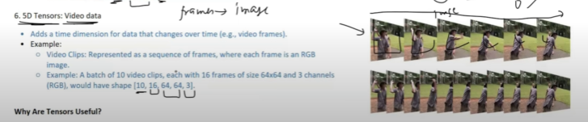

# What is Tensor
A tensor is a specialized multi-dimensional array designed for mathematical and computational efficiency.

## Zero-Dimensional Tensor

A zero-dimensional tensor (also called a scalar tensor) is a tensor with no dimensions, meaning it contains only a single value. It has a shape of `torch.Size([])`.

## One-Dimensional Tensor

A one-dimensional tensor in PyTorch is a tensor with a single dimension, similar to a list or a 1D array.

### Real-World Use Cases for 1D Tensors:
- Stock prices over time
- Temperature readings for a week
- Daily sales of a product
- Sensor readings from a single device

## Two-Dimensional Tensor

A two-dimensional tensor (2D tensor) is a tensor that has two dimensions (rows and columns), similar to a matrix. In PyTorch, it is represented as a list of lists or a NumPy-like array. The shape of a 2D tensor is typically (rows, columns), meaning it has multiple rows and columns.

## Real-World Examples of 2D Tensors

### Grayscale Images
A grayscale image can be represented as a 2D tensor, where each element corresponds to a pixel intensity value.  
**Example**: A 28×28 image in the MNIST dataset is a 2D tensor of shape `(28, 28)`.

### Tables or Spreadsheets
Any structured data in tabular form can be represented as a 2D tensor, where rows are data entries and columns are features.  
**Example**: A sales record dataset where rows represent different days and columns represent sales in different regions.

### Word Embeddings in NLP
In natural language processing (NLP), word embeddings are often stored as 2D tensors where each row represents a word and each column represents a numerical feature.  
**Example**: A word embedding matrix of shape `(vocab_size, embedding_dim)`.

### Game Boards (Chess, Sudoku, etc.)
A game board (like a chessboard or a Sudoku grid) can be stored as a 2D tensor where each element represents a piece or number.  
**Example**: An 8×8 chessboard can be stored as a `torch.Size([8, 8])` tensor.

## Three-Dimensional Tensor

A three-dimensional tensor in PyTorch can be thought of as a collection of two-dimensional matrices (like a stack of matrices). It has a shape of (d1, d2, d3), where d1, d2, and d3 represent the dimensions.

### Real-World Use Cases for 3D Tensors:
-  Color images in computer vision
-  Video frames (height, width, channels over time)
-  3D volumetric data (like MRI scans)
-  Batch of images (batch size, height, width, channels)

## Four Dimensinal Tensor

A four-dimensional tensor in PyTorch can be thought of as a collection of three-dimensional tensors, often used to represent batches of data. It has a shape of (n, d1, d2, d3), where:

-  n: number of samples (e.g., batch size)
-  d1: height (number of rows of pixels or other measurements)
-  d2: width (number of columns of pixels or other measurements)
-  d3: channels (color channels or other features)

### Real-World Use Cases for 4D Tensors:

-  Batch of color images in deep learning models
-  Batch of video frames (time, height, width, channels)
-  Batch of 3D medical scans for analysis
-  Multiple examples in machine learning tasks (e.g., training on mini-batches)

## Five-Dimensional Tensor in PyTorch

A five-dimensional tensor in PyTorch can be thought of as a collection of four-dimensional tensors. It has a shape of `(n, d1, d2, d3, d4)`, where:

- **n**: number of samples (e.g., batch size)
- **d1**: height (number of rows)
- **d2**: width (number of columns)
- **d3**: channels (color channels or other features)
- **d4**: additional dimensions (such as time or multiple features)

### Real-World Example: Batch of Videos 🎥
A five-dimensional tensor can represent a batch of videos, where each video consists of multiple frames. For example, consider a batch of 8 videos, each containing 30 frames, with a height of 256 pixels, a width of 256 pixels, and 3 color channels (RGB).

